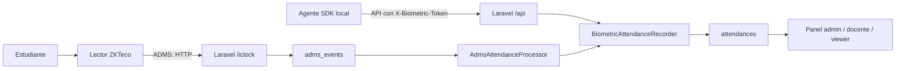
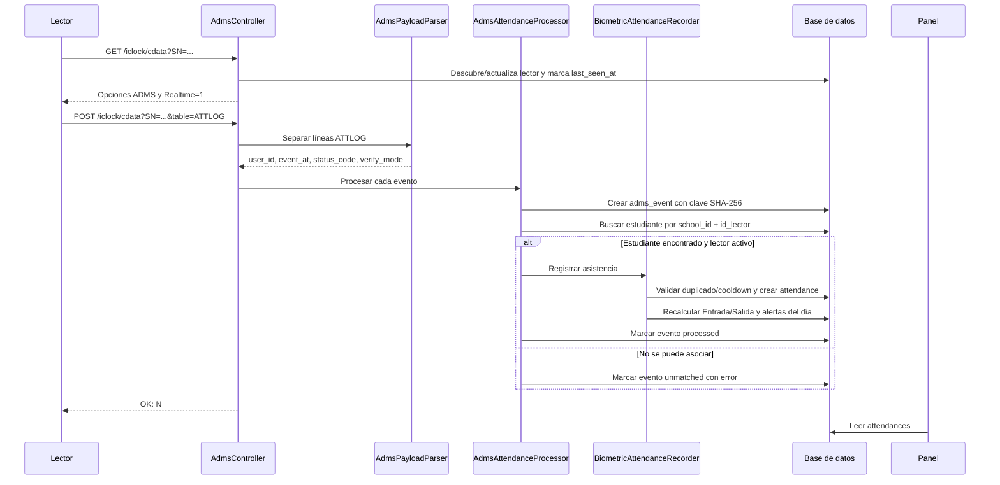
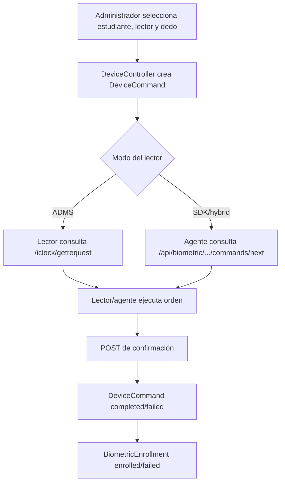

# Flujo de recolección biométrica

Este documento describe cómo una marcación viaja desde un lector biométrico hasta los paneles del sistema. Las rutas y nombres corresponden al código actual de `main`.

## Resumen de arquitectura

Hay dos formas de entrada:

- **ADMS:** el lector inicia la comunicación con Laravel y envía sus eventos a `/iclock/cdata`.
- **SDK/agente:** un proceso local consulta los lectores y envía los eventos procesados a `/api/asistencia`.

El puerto `590` es el puerto objetivo del servicio web/nodo que expone Laravel. No debe confundirse con el puerto de comunicación propio del lector SDK, que se guarda en `biometric_devices.port` y por defecto sigue siendo `4370`.

## Secuencia de una marcación ADMS

## Identificación y estados

1. El lector se identifica por el parámetro `SN` (número de serie).
2. Si no existe, se crea como lector pendiente de asignación.
3. El lector debe estar activo y asignado a una escuela.
4. El `user_id` recibido debe coincidir con `students.id_lector` de la misma escuela.
5. El evento original se conserva en `adms_events` aunque todavía no pueda asociarse.

Estados principales de `adms_events`:

| Estado | Significado |
| --- | --- |
| `processed` | Se asoció el evento y se creó o recuperó la asistencia. |
| `unmatched` | Falta asignar/activar el lector o no existe el ID biométrico del estudiante. |

Los eventos `unmatched` se reintentan durante las consultas ADMS y antes de entregar comandos al lector, hasta el límite configurado por `retryUnmatched`.

## Reglas de persistencia

`BiometricAttendanceRecorder` aplica estas reglas dentro de una transacción:

- La clave `device_event_key` evita registrar dos veces el mismo evento.
- La ventana `attendance_cooldown_minutes` evita múltiples marcaciones cercanas cuando el evento no tiene clave de dispositivo.
- Los registros válidos del día se ordenan por hora: posiciones pares son `Entrada` y posiciones impares `Salida`.
- La hora de entrada y el margen configurado determinan `is_late`.
- Una salida anterior a la hora configurada determina `is_early_departure`.
- Una marcación ignorada conserva el evento, pero queda con `is_ignored=true` y no altera el cálculo del día.

## Endpoints

### ADMS del lector

| Método | Ruta | Autenticación | Función |
| --- | --- | --- | --- |
| `GET`/`POST` | `/iclock/cdata?SN={serial}&table=ATTLOG` | Identificación por `SN`; rate limit | Negociación ADMS y recepción de marcaciones. |
| `GET`/`POST` | `/iclock/registry?SN={serial}` | Identificación por `SN`; rate limit | Registro/heartbeat del lector. |
| `GET` | `/iclock/getrequest?SN={serial}` | Identificación por `SN`; rate limit | Entrega comandos pendientes (`INFO`, hora). |
| `POST` | `/iclock/devicecmd?SN={serial}` | Identificación por `SN`; rate limit | Recibe confirmación de comandos. |

### Agente SDK

Todos estos endpoints requieren el header `X-Biometric-Token`, cuyo valor es `BIOMETRIC_API_TOKEN`.

| Método | Ruta | Función |
| --- | --- | --- |
| `GET` | `/api/biometric/devices` | Lista lectores activos en modo `sdk` o `hybrid`. |
| `POST` | `/api/biometric/devices/{key}/heartbeat` | Reporta conexión, inventario, hora y errores. |
| `GET` | `/api/biometric/devices/{key}/attendance/checkpoint` | Devuelve el último evento conocido para sincronización offline. |
| `GET` | `/api/biometric/devices/{key}/commands/next` | Obtiene y bloquea el siguiente comando. |
| `POST` | `/api/biometric/commands/{command}/complete` | Confirma el resultado del comando. |
| `POST` | `/api/asistencia` | Recibe una marcación del agente y la registra. |

## Enrolamiento y comandos

Las órdenes de inspección y sincronización de hora pueden viajar por ADMS. Las órdenes de enrolamiento y verificación requieren el agente SDK según el estado actual del código.

## Puerto 590

La migración al puerto `590` afecta al servicio web/nodo que debe ser alcanzable por los lectores o por el proxy inverso. El cambio debe coordinarse en cuatro puntos:

1. Proceso PHP/Laravel que escucha localmente.
2. `APP_URL` y URL configurada en los lectores ADMS.
3. Firewall, NAT, Tailscale Serve o proxy inverso.
4. Scripts de instalación y operación del nodo.

El cambio no altera las rutas `/iclock/*` ni `/api/*`; solo modifica la dirección de red donde esas rutas están disponibles. La configuración del puerto propio de un lector SDK es independiente.

## Diagnóstico rápido

| Síntoma | Revisar |
| --- | --- |
| No aparece el lector | `SN`, firewall, URL pública, `last_seen_at` y `/iclock/registry`. |
| Evento `unmatched` | `school_id`, lector activo y `students.id_lector`. |
| Eventos repetidos | `device_event_key`, `attendance_cooldown_minutes` y hora del lector. |
| Lector conectado pero sin comandos | Estado de `device_commands` y `/iclock/getrequest` o `commands/next`. |
| El agente no conecta | `BIOMETRIC_API_TOKEN`, `key`, red local y puerto del dispositivo. |
| Puerto 590 inaccesible | Proceso escuchando, firewall, NAT/proxy y URL configurada en el lector. |

## Archivos principales

- `routes/web.php`: definición de rutas web, ADMS y API del agente.
- `app/Http/Controllers/AdmsController.php`: protocolo ADMS.
- `app/Services/AdmsPayloadParser.php`: parser de líneas `ATTLOG`.
- `app/Services/AdmsAttendanceProcessor.php`: asociación del evento al estudiante.
- `app/Services/BiometricAttendanceRecorder.php`: deduplicación, cooldown y reglas de asistencia.
- `app/Http/Controllers/BiometricAgentController.php`: API del agente SDK.
- `app/Http/Controllers/DeviceController.php`: lectores, enrolamientos y comandos.
- `app/Models/AdmsEvent.php`, `app/Models/Attendance.php`: persistencia de eventos y asistencias.
- `scripts/biometrico.py`: muestra las URLs ADMS configuradas por `APP_URL`.
- `scripts/windows/run-school-node.ps1`: proceso web local y cola del nodo Windows.
